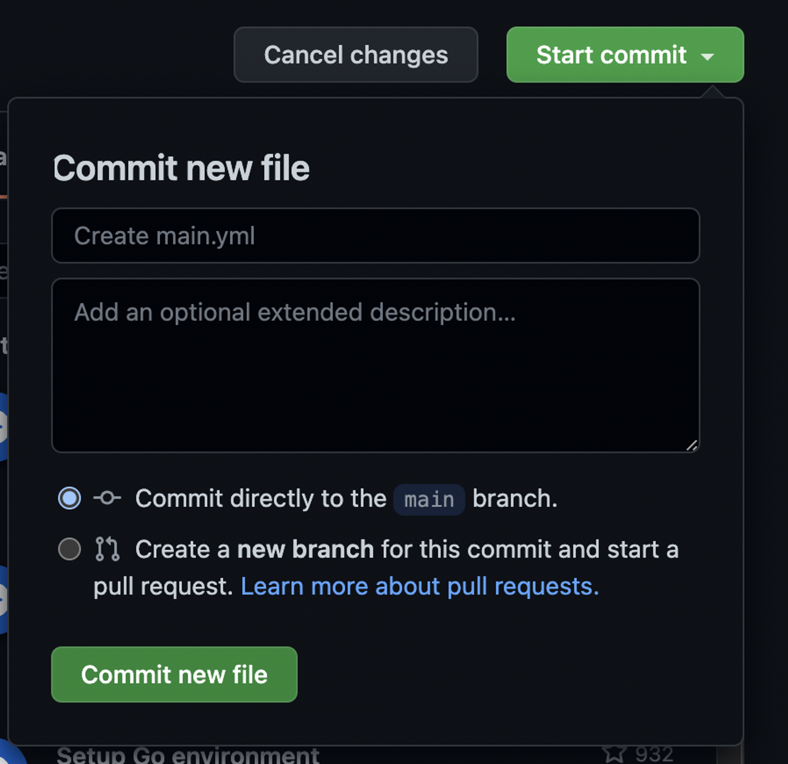

# Github Actions - workflow

깃허브 액션을 사용하기 위해서 전용 저장소를 하나 생성한다.


새 저장소의 여러 탭 중에 Actions를 선택하면 다음과 같은 화면이 등장한다. 저장소에 행위를 등록하기 위해서 다양한 설정이나 명령들을 추가해야 하는 데, 이를 개발하는 입장에서 처음부터 모두 설정해야 하는 것은 너무 비 생산적이다.

따라서 깃허브에서는 개발자에게 사용할 수 있는 최소한의 템플릿들을 다양하게 제공하고 있다. 이러한 점들이 Jenkins 같은 도구와 비교하여 프로젝트를 진행할 때, 원활하고 빠르게 진행할 수 있는 점이 아닐까 싶다.


그 중에서 우리는 템플릿을 일단 선택하지 않고, set up yourself 버튼을 클릭하여 완전 기본을 만들어본다.

[Events that trigger workflows - GitHub Docs](https://docs.github.com/en/actions/using-workflows/events-that-trigger-workflows)

깃허브 공식문서를 통해 트리거를 발생시키는 이벤트 타입에 대한 내용들이 나와있다. 본 예제는 간단한 예제이기 때문에 추가로 필요한 이벤트들이 있다면 공식문서를 통해 확인할 수 있다.

기본적으로 우리가 깃허브를 사용하면서 자주 쓰는 push , pull , commit들을 시작으로 아주 많은 이벤트 타입을 지원하고 있다.

아래는 예제에서 Actions으로 등록한 아주 간단한 예제이다.

```java
name: Hello World

on: [push]

jobs:
  build:
  
    runs-on: ubuntu-lastest
    
    steps:
    - name: Run pwd
      run: pwd
    - name: Run ls -al
      run: ls -al
```

`name`은 사용자가 설정할 수 있다. GithubActions의 주요 활용인 CI / CD 혹은 사용자가 원하는 행위의 이름을 붙이면 된다.

`on`은 앞에서 언급했던 이벤트 타입을 선언하는 부분이다. push를 지정했기 때문에 해당 행위들은 push 이벤트가 발생하면 일어나게 된다.

`jobs` 부터는 이제 어떤 행동들이 어디서 어떻게 일어나는 지 정확하게 명시하는 부분들이다.

`steps` 아래의 `name` 은 실제 발생할 동작의 이름이다. `run` 에는 실제 발생할 동작을 적어주면 된다.

행동들을 간단하게 살펴보면 pwd 명령을 통해 현재 디렉토리를 파악하고, 현재 디렉토리에 있는 파일 리스트를 -al 태그를 통해 모두 가져오는 것을 알 수 있다.



동작들에 대한 명세가 끝났으면 커밋을 할 수 있다. 여기는 우리가 자주 사용했던 깃허브 커밋과 같다. 커밋 제목을 적고 커밋에 대한 설명을 붙일 수 있다. 물론 생략 가능하다.


커밋을 모두 마치면 저장소에 github라는 폴더 아래 workflow폴더와 금방 작성했던 명세가 들어있다. 물론 우리가 커밋을 통해 새롭게 생성한것들은 clone 혹은 다운로드를 통해 직접 확인이 가능한 것들이다. → **만약 이것들을 로컬에서 수정하고 새롭게 커밋, 푸시하게 된다면?**


init commit이라는 커밋 제목과 함께 새로운 내용을 푸시했다. github Actions에 들어가니 workflow에 새로운 항목이 추가됨을 확인할 수 있다. 여기서 문제가 조금 있었다. latest를 lastest로 작성하는 바람에 빌드가 제대로 되지 않았다. workflow파일을 바로 수정하여 새롭게 커밋했다.


이제 해당 커밋에 대한 Actions을 확인 가능하다.


이전에 workflow에 작성했던 명령어들을 각각 눌러보면 모두 정상적으로 작동하는 것을 알 수 있다. 해당 예제는 현재 디렉토리 위치만을 알려주기만 할 뿐 어떤 작동도 하고 있다고 보기는 힘들다. 그러나 이러한 단순한 예제를 통해 github 이벤트를 통한 자동화가 가능하다는 사실은 아주 간단하게 알아보았다.

현재 디렉토리 위치와 파일 목록들을 통해서 우리는 github가 우리에게 제공하는 컴퓨터에 어떠한 것도 있지 않다는 것을 알 수 있다.