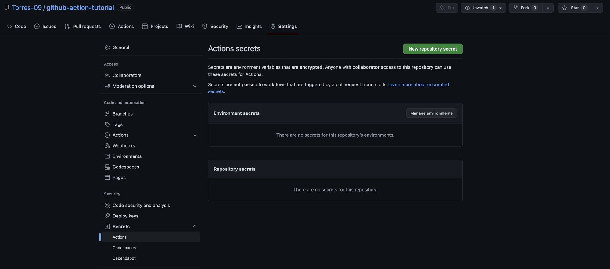
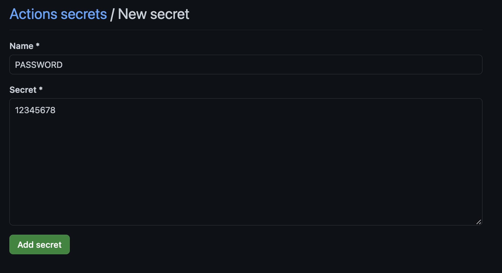
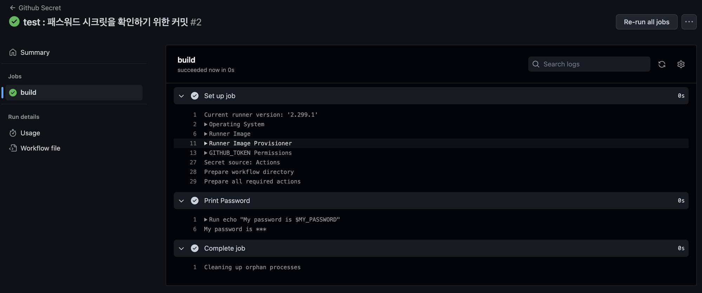

# Github Actions - Secret

내가 본 내용을 공부하고자 했던 가장 큰 이유이다. 프로젝트를 하다보면 api key , ID 정보들을 외부에 노출하지 않고 작업해야 하는 데 이것이 쉽지가 않다. 이를 깃허브에서는 secret을 통해 해결해주고 있다.



저장소의 세팅을 들어가서 좌측 메뉴 중 시크릿을 누르면 해당 메뉴로 이동이 가능하다. 우측에 시크릿을 새롭게 만들 수 있는 버튼이 있다. 클릭하여 시크릿을 생성한다.



이름은 보통 대문자로 만드는 게 관례인 듯 하다. 아래는 해당 이름에 매칭되는 값을 넣어주면 된다. 예제에서는 아주 간단하게 넣어주었다. 실제로는 인코드되어 있거나 등등 알 수 없게 되어있을 것이다.

```java
name: Github Secret

on: [push]

jobs:
  build:
  
    runs-on: ubuntu-latest
    
    steps:
    - name: Print Password
      env:
        MY_PASSWORD: ${{ secrets.PASSWORD }}
      run: echo "My password is $MY_PASSWORD"
```

이제 액션에는 해당 패스워드를 확인하기 위해서 다음과 같은 코드를 추가한다. 내용은 이전과 거의 동일하다. 다만 시크릿 변수를 내가 추가해주었기 때문에 시크릿 뒤에 내가 지정한 이름을 넣어주면 된다.



액션에서는 비밀번호가 잘 들어간 것을 확인할 수 있다. 다만 출력을 했음에도 별표로 표시되는 것을 알 수 있는데 기본적으로 시크릿 정보들은 말 그대로 시크릿이기 때문에 외부에 노출되지 않는다.

또한 한 번 시크릿을 지정하면 그 내용을 수정하거나 삭제할 수 있을뿐 확인은 불가능하다. 이를 참고하여 시크릿 변수를 외부에 노출하지 않도록 잘 관리해야 한다.