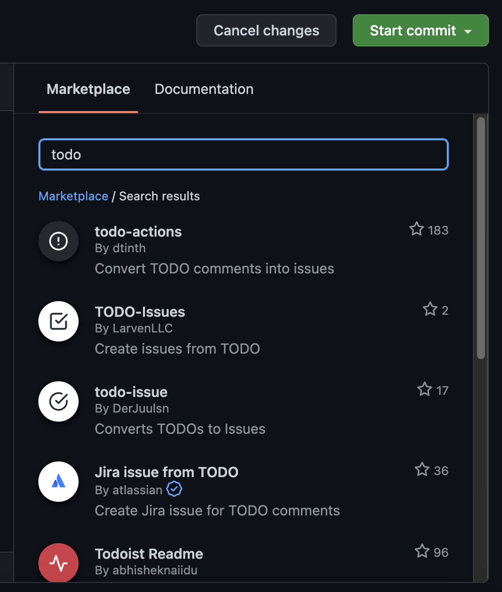
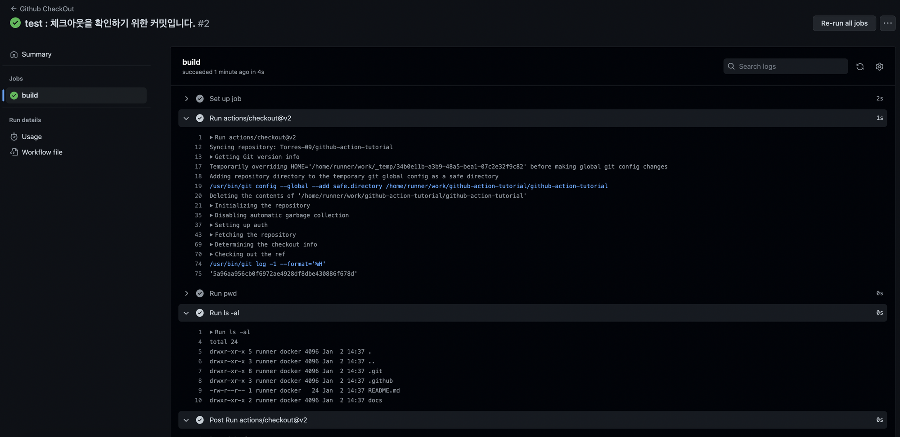

# Github Actions - uses

이전에는 push를 통해 현재 디렉토리와 파일 목록들을 확인할 수 있는 어떻게 보면 전혀 의미없는 예제들을 수행해봤다. → github event로 action들이 수행된다는 사실을 파악하는 데는 꽤나 의미가 있었다.

사실 action 코드는 실제로 사용자가 Product ( 여기서 사용자는 개발자를 의미한다. )를 만드는 데 있어서 부가적인 용도일 뿐 주요 목적을 달성하지는 않는다. 따라서 굉장히 비 생산적이라고 볼 수 있는데 이것들을 놀랍게도 미리 만들어진 내용안에서 활용이 가능하다. dockerHub의 이미지들과 비슷하다고 생각하면 이해가 쉽다. github/actions/{~~~} 링크에는 이런 액션들이 미리 만들어져있다. → 깃허브에서 제공하는 액션들이기 때문에 믿고 이용할 수 있다.

Action들을 작성하는 스크립트 오른쪽에 마켓플레이스에 검색하여 미리 만들어진 action들을 살펴볼 수 있다. 이곳에는 공식으로 지원하는 액션 뿐 아니라 개인 사용자들이 추가로 만들어서 공유하는 action까지 모두 살펴볼 수 있다. 우리가 많이 사용하는 인텔리제이 혹은 VScode의 플러그인 정도로 생각하면 이해가 쉬울 것 같다. 해당 액션을 클릭하여 자세히 보도록 하겠다.

해당 Action은 현재는 구현하지 않았지만 곧 구현할 내용에 대하여 TODO 주석을 작성하면 이를 자동으로 인식하여 이슈로 발급해주는 기능이다. 이는 나중에 추가해보도록 하고 일단은 checkout 액션을 살펴보도록 하자.

해당 액션은 깃허브에서 기본으로 제공하고 있다. 이미 만들어져있는 액션들을 이용하는 방법은 간단하다. 바로 `uses` 에 추가할 액션 경로를 부착하면 된다.

이전 예제를 통해 현재 디렉토리 위치와 디렉토리에 있는 파일목록들을 알아봤다. 어떠한 파일들도 존재하지 않았다. 그런데 이번에는 checkout을 통해 버전이 변경되어있을 때, 해당 버전을 checkout하도록 하는 액션을 해보겠다.

기존에는 없었던 CheckOut에 대한 Action이 추가되었다. 해당 액션을 눌러서 어떤 작용이 있는 지 확인이 가능하다.

새로운 커밋에 대한 새로운 액션에 대한 결과이다. 전에는 어떠한 파일도 없었는데 이제는 프로젝트에 있는 소스코드 파일들이 모두 들어있게 되었다!! 이제 이 소스코드들을 이용하여 더 가치있고 생산적인 일을 자동적으로 수행할 수 있게 된 것이다.