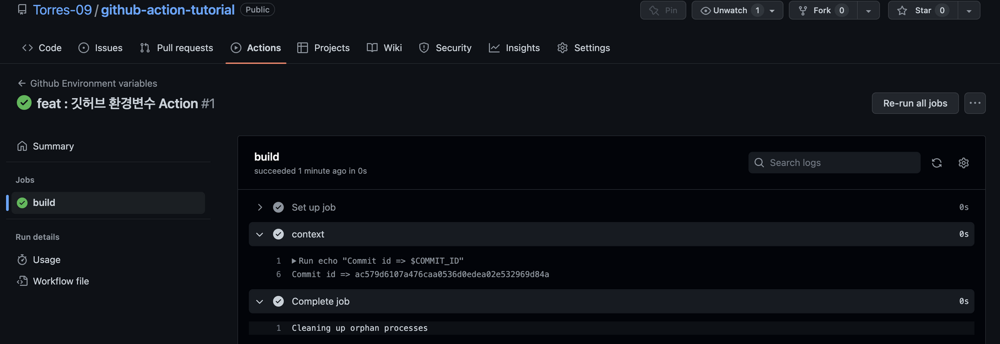

# Github Actions - Environment variables

[Contexts - GitHub Docs](https://docs.github.com/en/actions/learn-github-actions/contexts)

깃허브에서 미리 정해놓은 환경변수에 대한 것들을 알 수 있는 공식문서이다. 러너에는 다양한 환경변수가 미리 세팅되어 있다.

```java
name: Github Environment variables

on: [push]

jobs:
  build:
  
    runs-on: ubuntu-latest
    
    steps:
    - name: "context"
      env:
        COMMIT_ID: ${{ github.sha }}
      run: echo "Commit id => $COMMIT_ID"
```

`env` 를 통해 환경변수를 가져올 수 있다. 가져온 환경변수를 action을 통해 출력해보도록 하자. 아주 간단한 커밋 아이디를 출력해보자. 새롭게 추가되는 모습은 이제 생략한다.



액션을 확인해보면 커밋 아이디를 가져와서 정상적으로 출력하는 모습이다.